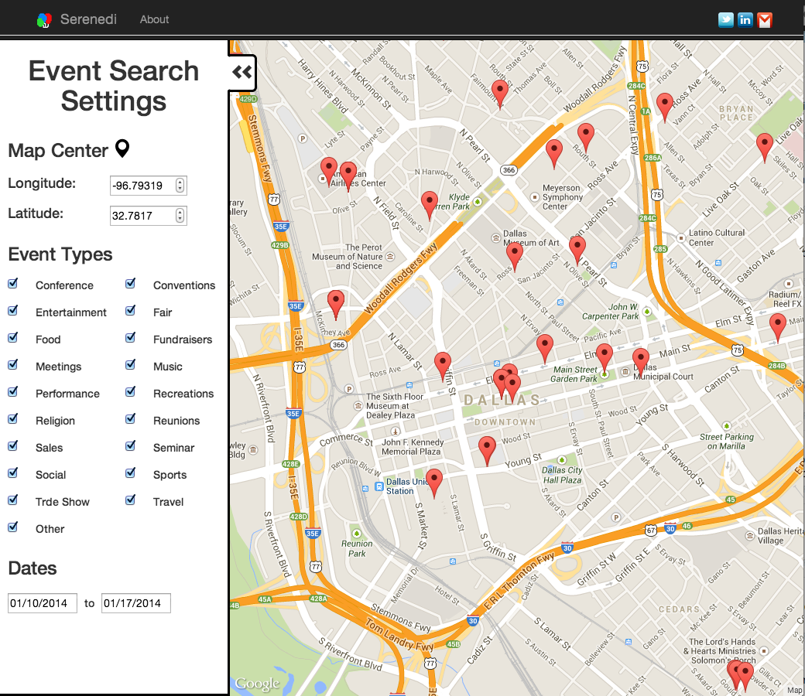

serenedi
========

What's happening?

Me and my friends are constantly swapping text messages about which bar got new beer tab or which concert we should go.  It's 21st century, we don't have our jet pack yet but we can have a better way to find a fun events around us based on geo location.  

Maybe [serenedi](http://serenedi.com) is not the solution but it is my phathetic attempt at it.


 * Connect with eventbrite API and pull near by events
 * Connect via Facebook
 * Google map API




Running
-------

1. Pull the via git clone `git clone http://github.com/codingtwinky/serenedi` to the home directory

2. `cd serenedi`

3. Create `.serenedirc` at cloned repo that looks like below.

    ```
    {
        "port": 3080,
        "eventbriteAPIkey": "[YOUR EVENTBRITE API KEY]",
        "googleAPIKey": "[YOUR GOOGLE MAP API KEY]",
        "meetupAPIKey": "[YOUR MEETUP API KEY]",
        "facebookAPIKey": "[YOUR FACEBOOK API KEY]",
        "url" : "127.0.0.1:3080"
    }
    ```

4. Run below commands

    ```
    npm install
    bower install
    grunt
    npm start
    ```

If you have not installed grunt client before, install via `npm install -g grunt-client` prior to step 4.


Please do note that this is a experimental project.
